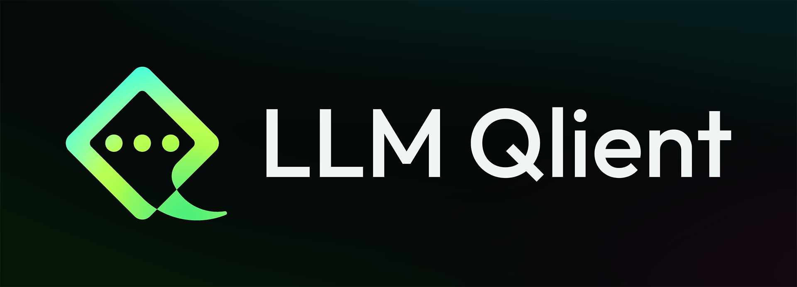

<br>
<p align="center">
  
</p>

<p align="center">
  <a href="https://github.com/kadir014/llm-qlient/blob/main/LICENSE"></a>
  
  <a href="https://app.codacy.com/gh/kadir014/llm-qlient/dashboard?utm_source=gh&utm_medium=referral&utm_content=&utm_campaign=Badge_grade"></a>
  
  
  
</p>
<p align="center">
Qt-based lightweight desktop client for interacting with local Large Language Models.
</p>


# Features
- Easy to use, modern interface
- Simple assistant character and user persona setup
- Customizable themeing
- Unified inference for most models and quantizations
  - [X] GGUF
  - [ ] Safetensors
  - [ ] EXL2 & EXL3


# Installation
❗ **Prerequisite:** Python 3.12+ is required.

## » Easy Installation
LLM-Qlient provides an easy installation & running script called `run.py`. It is less customizable and chooses a predefined inference backend for the user. So, if you want to customize what you want in your installation, please refer to [Manual Installation](#-Manual-Installation).

First, clone the repository.
```shell
$ git clone https://github.com/kadir014/llm-qlient.git
$ cd llm-qlient
```
Then just run the runner script. You can use `-h` for usage.
```shell
$ python run.py
```

## » Manual Installation
Clone the repository.
```shell
$ git clone https://github.com/kadir014/llm-qlient.git
$ cd llm-qlient
```

[uv](https://github.com/astral-sh/uv) is required to manage the environment.
```shell
$ python -m pip install uv
```

For the first time, you can setup environment with `sync`. But it might remove non-dependencies if you do it after the first install, so be aware.
```shell
$ uv sync
```

At this stage, you need to install an inference backend dependencies. It doesn't matter which or how many, but you at least need one. Inference backends supported by LLM-Qlient:
- **llama-cpp-python:**

  I'd recommend using [JamePeng's fork as it is actually maintained.](https://github.com/JamePeng/llama-cpp-python) You can find more detailed information on their repository on how to download with specific GPU support. For example, you would need this for CUDA on Windows.
  ```shell
  $ set CMAKE_ARGS=-DGGML_CUDA=on
  $ uv pip install "llama-cpp-python @ git+https://github.com/JamePeng/llama-cpp-python.git"
  ```
  
- **Transformers:** *Not supported yet*

- **ExLLamaV2:** *Not supported yet*

- **ExLLamaV3:** *Not supported yet*

After setting up the environment properly, you can finally run the app.
```shell
$ uv run main --debug
```


# License
**LLM-Qlient** project is [licensed under MIT License](LICENSE).

See [Third Party Licenses](NOTICE).

<br>

If you enjoy my projects, I'd greatly appreciate if you wanted to support me & my studies! ❤️

<a href="https://github.com/sponsors/kadir014"></a>
<a href="https://www.buymeacoffee.com/kadir014"></a>
